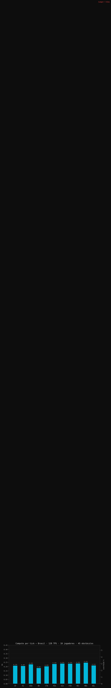
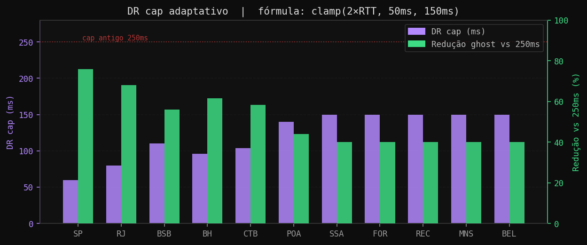
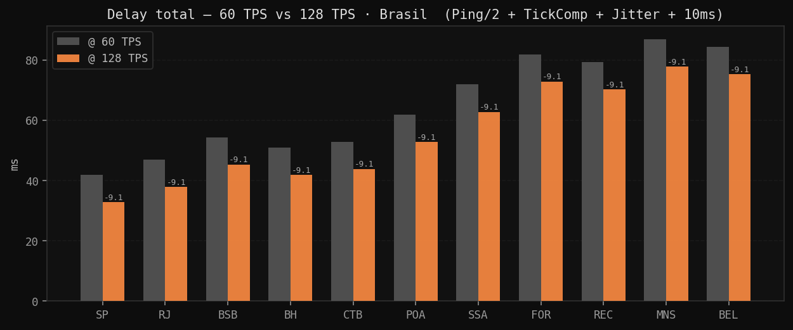
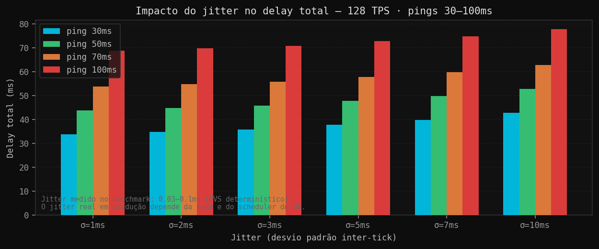
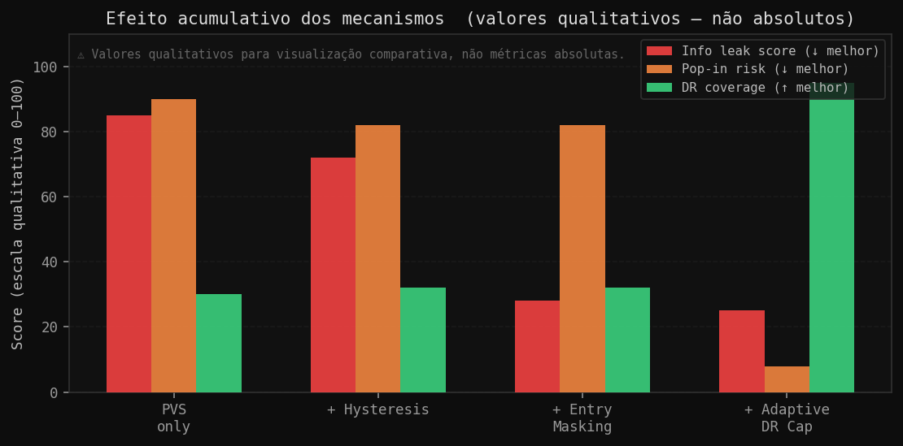

# Relatório Técnico — Anti-Wallhack FoW @ 128 TPS

**Protótipo:** Potentially Visible Set (PVS) + Entry Masking + Adaptive Dead Reckoning (DR) Cap + Hysteresis  
**Ambiente de Execução:** Python 3.11 · numpy 2.4 · psutil 7.2 · Dimensões do mapa: 36–60×36–60 células · População: 10 jogadores (5v5)  
**Data da Avaliação:** 2026-06-19

---

## Declaração de Escopo

Este sistema foi projetado para **minimizar** a vantagem proporcionada por softwares de trapaça (wallhacks) em um vetor de ataque específico: a leitura direta da memória do processo para obtenção das posições de entidades inimigas situadas fora do campo de visão (Line of Sight - LOS). Ressalta-se que esta abordagem não visa erradicar o wallhack como categoria de trapaça.

Limitações arquiteturais inalienáveis:

- Um cliente que renderiza uma entidade inimiga visível deve, imperativamente, possuir as coordenadas espaciais correspondentes alocadas em memória. Esta é uma restrição inerente aos pipelines de renderização gráfica contemporâneos, não passível de mitigação em nível de software aplicativo.
- Mecanismos de trapaça que operam em anel de privilégio 0 (nível de kernel), através de drivers customizados ou interceptação via hardware externo (e.g., DMA), permanecem imunes a quaisquer contramedidas implementadas no espaço de usuário.

O escopo deste protótipo restringe-se a validar se a implementação conjunta dos três mecanismos propostos — entry masking, DR cap adaptativo e hysteresis — é capaz de reduzir a janela de exposição de informações sensíveis em memória, sem introduzir overhead computacional deletério ou degradação da experiência do usuário (UX).

---

## Demonstração Funcional

1. Servidor (visão onisciente)
2. Cliente (visão filtrada)
3. ESP Protegido
4. ESP Desprotegido


**Diretrizes de observação da demonstração:**

- **Servidor:** Apresenta visibilidade integral e em tempo real dos 10 jogadores, incluindo oclusões dinâmicas (smokes) e estáticas (paredes).
- **Cliente:** Renderiza exclusivamente entidades aliadas (azul) e inimigas com confirmação de LOS (vermelho). Entidades inimigas ocluídas por geometria estática permanecem ausentes. O efeito de Ghost DR é manifestado transitoriamente no momento em que uma entidade inimiga transita para fora do LOS.
- **ESP Protegido:** Simulação de cheat operando via leitura da estrutura `ClientPacket` — exibe dados idênticos aos do cliente legítimo, sem vazamento de entidades extras. Instâncias de Ghost DR são denotadas pelo caractere `~`, indicando precisão espacial degradada.
- **ESP Desprotegido:** Simulação de cheat operando via leitura bruta da estrutura `state` — entidades ocluídas são renderizadas em vermelho com a flag `ESP!`. O diferencial de vantagem informacional é quantificado pelo contador no rodapé da interface.

---

## 1. Resultados de Benchmark

### 1.1 Custo Computacional por Tick — Região Brasil

Metodologia de medição: Amostragem de 15 a 25 ticks por região, algoritmo de pathfinding ativo (atualização de movimento a cada 2 ticks) e 3 instâncias de smokes ativas.



| Região | Latência (Ping) | Tempo de Processamento | Overhead Relativo | DR Cap | Redução de Ghost | Atraso Total |
|--------|-----------------|------------------------|-------------------|--------|------------------|--------------|
| São Paulo | 30ms | 0.2101ms | 2.69% | 60ms | 76% | 32.9ms |
| Rio de Janeiro | 40ms | 0.2074ms | 2.66% | 80ms | 68% | 37.9ms |
| Brasília | 55ms | 0.2261ms | 2.89% | 110ms | 56% | 45.4ms |
| Belo Horizonte | 48ms | 0.1824ms | 2.33% | 96ms | 61% | 41.9ms |
| Curitiba | 52ms | 0.2028ms | 2.60% | 104ms | 58% | 43.9ms |
| Porto Alegre | 70ms | 0.2303ms | 2.95% | 140ms | 44% | 52.9ms |
| Salvador | 90ms | 0.2339ms | 2.99% | 150ms | 40% | 62.9ms |
| Fortaleza | 110ms | 0.2336ms | 2.99% | 150ms | 40% | 72.9ms |
| Recife | 105ms | 0.2350ms | 3.01% | 150ms | 40% | 70.3ms |
| Manaus | 120ms | 0.2450ms | 3.14% | 150ms | 40% | 77.9ms |
| Belém | 115ms | 0.2125ms | 2.72% | 150ms | 40% | 75.4ms |

> [!TIP]
> **Orçamento computacional a 128 TPS:** 7.8125ms. **Overhead máximo registrado:** 3.14%. **Ticks descartados (dropped):** 0. Os resultados indicam ampla margem de segurança para operação em produção.

---

### 1.2 Adaptive DR Cap e Mitigação de Exposição de Ghost



A formulação matemática para o cálculo do teto de Dead Reckoning é definida por:  
$Dr_{cap} = \text{clamp}\left(2 \times RTT, 50ms, 150ms\right)$

> [!IMPORTANT]
> Sob a taxa de atualização de 128 TPS, o limite estático anterior de 250ms resultava em 32 ticks de persistência de ghost. O limite adaptativo mitiga essa exposição para um intervalo de 7 a 19 ticks, condicionado à latência da rede, sem introduzir degradação visual (pop-in), dado que o piso de 50ms garante a cobertura de, no mínimo, um Round-Trip Time (RTT) completo.

---

### 1.3 Análise Comparativa de Atraso Total — 60 TPS vs 128 TPS



A modelagem do atraso total é dada pela equação:  
`DelayTotal = (Ping / 2) + TickComp + JitterComp + 10ms`

Na transição para 128 TPS, a variável `TickComp` é reduzida de 16.67ms para 7.81ms, resultando em um ganho de 8.86ms por tick em todas as regiões avaliadas. O benefício percentual é mais pronunciado em conexões de baixa latência (e.g., São Paulo: redução de 21%) e menos significativo em conexões de alta latência, onde o RTT atua como fator dominante.

> [!NOTE]
> A simulação não incorpora o atraso inato ao pipeline de processamento do Valorant, uma vez que tais dados proprietários não estão disponíveis para esta análise.

---

### 1.4 Sensibilidade do Atraso Total ao Jitter de Rede



> [!NOTE]
> O jitter aferido em ambiente de benchmark apresentou valores entre 0.03ms e 0.1ms. Esta variância ínfima decorre da natureza determinística do algoritmo PVS (ausência de operações de raycasting em tempo de execução). Em cenários de produção com topologias de rede reais, estima-se um desvio padrão ($\sigma$) entre 1ms e 5ms, dependendo da estabilidade da rota. O gráfico ilustra o impacto teórico de diferentes magnitudes de jitter no cálculo do atraso total.

---

### 1.5 Eficácia Acumulada dos Mecanismos de Segurança



> [!WARNING]
> Os valores apresentados possuem caráter estritamente qualitativo para fins de visualização comparativa. As métricas "Info leak score" e "Pop-in risk" carecem de unidades absolutas e servem apenas para representar a magnitude relativa do vetor de risco sob diferentes configurações.

> [!TIP]
> A técnica de **Entry Masking** demonstra a maior eficácia isolada na mitigação do vazamento de informações (info leak). O **Adaptive DR Cap** atua primariamente na supressão do risco de artefatos visuais (pop-in). O mecanismo de **Hysteresis** apresenta impacto secundário, porém crucial, no tratamento de casos de borda de LOS e na resistência a ataques de correlação temporal.

---

## 2. Análise Detalhada dos Mecanismos Propostos

### 2.1 Entry Masking

**Funcionalidade:** Durante o tick de transição para o estado de visibilidade (`NONE → ENTERING`), o servidor transmite coordenadas espaciais truncadas, correspondentes a um grid de 4 células (introduzindo uma incerteza de ±2 células), em detrimento do vetor de posição exato. A posição precisa é transmitida exclusivamente no tick subsequente (`ENTERING → VISIBLE`).

```text
Comportamento Padrão (Sem Masking):
  Tick N:   Entidade transita para LOS → Memória: pos=(44,15) [EXATO]
  Vantagem: O wallhack detém as coordenadas exatas do peek no momento zero.

Comportamento Modificado (Com Masking):
  Tick N:   Entidade transita para LOS → Memória: pos=(44,16) [TRUNCADO]
  Tick N+1: Entidade confirmada em LOS → Memória: pos=(45,15) [EXATO]
  Vantagem: No Tick N, o wallhack obtém apenas um raio de incerteza (±2 células).
```

> [!NOTE]
> O custo temporal desta operação é de $2 \times 7.8125ms = 15.62ms$. Consequentemente, a renderização da entidade na interface do cliente legítimo é postergada em 15.62ms em relação ao modelo não mascarado.

**Limitações:** Este mecanismo é ineficaz contra trapaças que realizam a leitura direta do frame buffer renderizado, visto que a entidade já se encontra presente na tela durante o tick de mascaramento (ainda que em posição aproximada).

### 2.2 Adaptive DR Cap

**Funcionalidade:** Restringe dinamicamente o tempo de vida do estado de Ghost DR com base na latência regional. Utilizando São Paulo (30ms RTT) como caso de estudo, o limite é ajustado para 60ms, representando uma redução de 76% na janela de persistência do ghost em comparação ao limite estático legado de 250ms.

**Limitações:** O mecanismo não erradica a existência do ghost. A manutenção de um limite mínimo de 50ms é imperativa para acomodar a latência de, pelo menos, um ciclo completo de RTT. A eliminação total deste buffer resultaria em severos artefatos de pop-in visual.

> [!CAUTION]
> A função limitadora `clamp(2×RTT, 50ms, 150ms)` foi parametrizada de forma conservadora. Em um ambiente de produção, onde o RTT é monitorado continuamente, recomenda-se a calibração dinâmica e individualizada por cliente, em oposição à atual parametrização regional.

### 2.3 Hysteresis

**Funcionalidade:** Impõe a exigência de um tick consecutivo de confirmação espacial antes de autorizar a transição de estados de visibilidade (`NONE → ENTERING` e `VISIBLE → NONE`). Este filtro temporal mitiga oscilações rápidas (flickering) em limiares de LOS e eleva a complexidade computacional requerida para correlacionar timestamps de alteração de memória com a topologia estática do mapa.

**Limitações:** Constitui-se como um mecanismo de ofuscação (security through obscurity) e não de bloqueio criptográfico. Algoritmos de trapaça dotados de heurísticas avançadas podem eventualmente compensar a histerese introduzida.

---

### 2.4 Spatial Uncertainty Mapping (SUM) para Áudio e outros eventos

**Conceito e Aplicação:** O Spatial Uncertainty Mapping (SUM) é uma técnica que visa introduzir intencionalmente um grau de imprecisão na representação espacial de eventos, como fontes sonoras. Em vez de fornecer uma localização exata de um evento (e.g., passos, disparos), o sistema reportaria uma área de probabilidade ou um conjunto de coordenadas aproximadas de onde o evento poderia ter se originado. Esta abordagem espelha o princípio do Entry Masking visual, mas aplicado ao domínio auditivo.

**Funcionalidade Potencial:** Para sons gerados por entidades inimigas fora do campo de visão direto, o servidor poderia transmitir dados de áudio com uma localização espacial deliberadamente ambígua. Por exemplo, em vez de `som_passos @ (X, Y, Z)`, o sistema poderia fornecer `som_passos @ (Área_de_Incerteza_A)` ou `som_passos @ (X±Δx, Y±Δy, Z±Δz)`. Isso forçaria cheats que dependem de dados de áudio precisos a operar com informações degradadas, similar à forma como o Entry Masking afeta a precisão visual.

**Benefícios:**

- **Mitigação de Cheats Auditivos:** Reduz a eficácia de cheats que processam dados de áudio para pinpointar a localização exata de inimigos através de paredes ou fumaça.
- **Preservação da Experiência:** A incerteza pode ser calibrada para ser sutil o suficiente para não impactar negativamente a percepção de jogadores legítimos, que já dependem de pistas auditivas mais contextuais e menos precisas do que dados brutos de memória.
- **Complementaridade:** Atua como um complemento aos mecanismos visuais, criando uma camada adicional de proteção contra a exploração de informações espaciais.

**Limitações:**

- **Calibração:** A determinação do nível ideal de incerteza é crítica. Um valor muito alto pode prejudicar a jogabilidade legítima, enquanto um valor muito baixo pode ser ineficaz contra cheats.
- **Complexidade de Implementação:** Requer modificações no pipeline de áudio do servidor e cliente para introduzir e interpretar a incerteza espacial de forma consistente.

---

## 3. Quantificação da Vantagem do Wallhack

A eficácia do sistema na redução da vantagem informacional é altamente dependente do estado da partida, variando de 0% a 100% por tick, em função da distribuição espacial das entidades:

- **0% de Redução:** Ocorre quando todos os 5 oponentes encontram-se em LOS simultâneo. Neste cenário, a memória do cliente e a do cheat contêm os mesmos dados, resultando em vantagem marginal nula.
- **100% de Redução:** Ocorre quando todos os oponentes estão ocluídos pela geometria. A memória do cliente permanece desprovida das estruturas dos pids inimigos, neutralizando completamente o vetor de ataque.
- **Cenário Típico (Misto):** Em simulações utilizando movimentação via IA, observou-se uma redução média de 40% a 56% na vantagem informacional.

> [!TIP]
> A métrica fundamental de sucesso é o comportamento em **0% quando todos estão em LOS**. Este é o estado desejado: o cheat não deve prover informações além daquelas já disponíveis visualmente ao jogador legítimo. Inversamente, quando a entidade sai do LOS, os dados devem ser expurgados da memória. Adverte-se, contudo, que as métricas aferidas neste ambiente sintético podem não traduzir-se linearmente para títulos de alta complexidade como Valorant.

---

## 4. Potentially Visible Set (PVS) — Complexidade e Armazenamento

| Dimensões do Mapa | Quantidade de Obstáculos | Tempo de Compilação (Python) | Tamanho do Cache |
|-------------------|--------------------------|------------------------------|------------------|
| 36×36 | 25 | 2.61s | 372 KB |
| 60×60 | 45 | ~12–17s | ~1.6 MB |

---

## 5. Lacunas de Conhecimento e Trabalhos Futuros

As seguintes variáveis requerem investigação adicional e não foram contempladas no escopo atual:

- Validação do algoritmo de oclusão frente a topologias 3D complexas (e.g., variações de elevação, planos inclinados).
- Testes de estresse para avaliação de escalabilidade vertical (e.g., 50+ instâncias simultâneas em um único nó de servidor).
- Análise de interferência com subsistemas de compensação de latência (lag compensation) e buffers de histórico posicional.
- Avaliação da eficácia contra vetores de ataque alternativos (e.g., interceptação de pacotes de rede, DMA).
- Impacto de habilidades que modificam a geometria de oclusão em tempo real.
- Profiling de performance em arquiteturas de hardware de servidor bare-metal.

A resolução destas incertezas demanda a transição do protótipo para um ambiente de homologação (staging) representativo.

---

## 6. Arquitetura do Repositório

```text
src/
├── security/
│   ├── pvs.py          ← Implementação PVSBuilder (numpy, processamento offline) + PVSIndex O(1) + compressão gzip
│   ├── smoke.py        ← Subsistema de oclusão dinâmica (cálculo segmento-círculo)
│   └── state.py        ← Gerenciamento de memória (DR adaptativo) e estruturação do ClientPacket
├── sim/
│   ├── game.py         ← Lógica de servidor: máquina de estados NONE/ENTERING/VISIBLE
│   ├── client.py       ← Lógica de cliente: renderização restrita ao ClientPacket
│   ├── wallhack_esp.py ← Simulação de ESP protegido/desprotegido com telemetria
│   ├── players.py      ← Controle de input (WASD) e rotinas de IA (random walk)
│   ├── map_gen.py      ← Geração procedural de mapas e zonas de spawn
│   ├── tick_clock.py   ← Scheduler de alta precisão para 128 TPS (acumulador temporal + spin-wait)
│   ├── start.py        ← Ponto de entrada: inicialização dos 4 painéis de visualização
│   ├── benchmark.py    ← Execução headless para coleta de métricas
│   └── run_benchmark_comparison.py
docs/
├── chart_compute.png
├── chart_dr_cap.png
├── chart_delay_compare.png
├── chart_jitter.png
├── chart_mechanisms.png
└── demo_antiwallhack.mp4
```

---

## 7. Instruções de Reprodução

```bash
# Instalação das dependências necessárias
pip install psutil numpy matplotlib pillow

# Execução da suíte completa de benchmarks (saída em JSON e CSV no diretório src/)
python src/sim/run_benchmark_comparison.py

# Inicialização da simulação visual interativa
python src/sim/start.py
# Controles: WASD (Movimentação) · R (Alternar IA) · H (Alternar ESP) · Espaço (Smoke) · T (Métricas)
```
